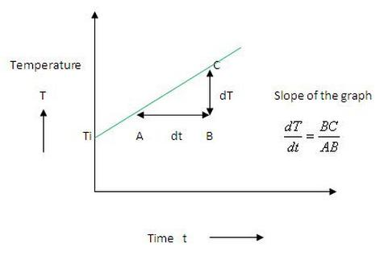
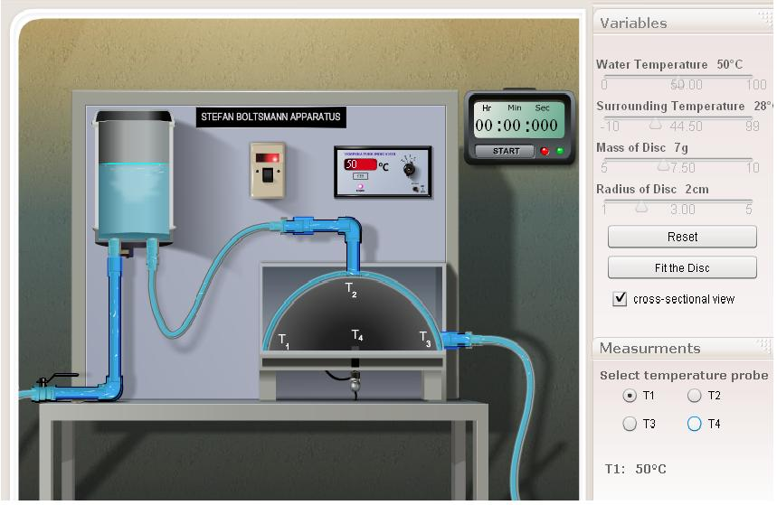
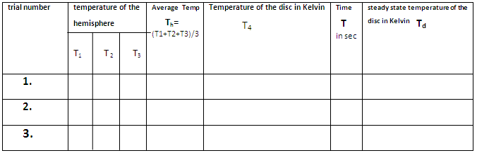

### Procedure

<iframe width="560" height="315" src="https://www.youtube.com/embed/onGuJZS8-Sc" frameborder="0" allow="autoplay; encrypted-media" allowfullscreen></iframe>

### Apparatus:
 
Heater, temperature-indicators, box containing metallic hemisphere with provision for water-flow through its annulus, a suitable black body which can be connected at the bottom of this metallic hemisphere.

### Procedure for performing real lab

  

 

<ol>
    <li style="text-align: justify; ">Remove the disc from the bottom of the hemisphere and switch on the heater and allow the water to flow through it.</li>
    <li style="text-align: justify; ">Allow the hemisphere to reach the steady state and note down the temperature T1, T2, T3 .</li>
    <li style="text-align: justify; ">Fit the disc (black body) at the bottom of the hemisphere and note down its rise in temperature with respect to time till steady state is reached.</li>
    <li style="text-align: justify; ">A graph is plotted with temperature of disc along Y-axis and time along X-axis as shown.</li>
    <li style="text-align: justify; ">Find out the slope dT/dt from the graph.</li>
</ol>

### Procedure for performing simulator

<ol>
    <li>Choose desirable values of water temperature, surrounding temperature, mass and radius of the disc using the sliders.</li>
    <li>Click the "Power ON" button and wait till T1, T2 ,T3 reach steady state. Note down its values.</li>
    <li>Putting T4 button, click "Fit the disc'' option.</li>
    <li>Note down T4 at different intervals of time till it reaches steady state.</li>
    <li>Plot Temperature-Time graph and determine its slope $\frac{dT}{dt}$.</li>
    <li>Determine Stefan's constant $\sigma$ using the given formula.</li>
</ol>

### Observations

  

 

## Calculations

Mass of the copper disc  =  ...... $kg$

Specific heat of copper  =  ...... $Jkg^{-1}$

Radius of the disc  = ..... $m$

Area of the disc = ......$m^{2}$

Slope of the graph   $\frac{dT}{dt}$ = ............... $Ks^{-1}$

Substituting the values in the given expression,

$$\sigma =\frac{mC_{p}}{A(T_{h}^4-T_{b}^{4})}\frac{dT}{dt}$$

## Result
Stefan-Boltzman's constant, $\sigma = .............. Wm^{-2}K^{-4}$
