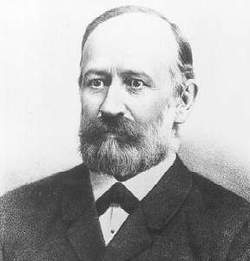
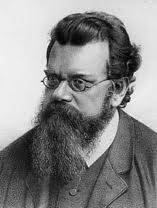
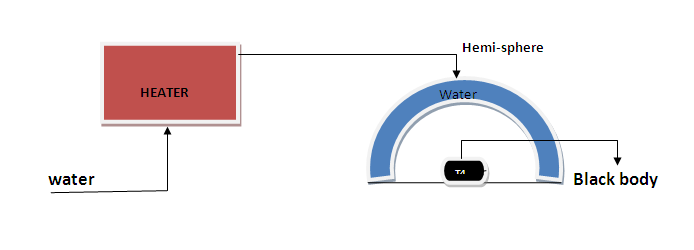

### Theory

A black body is an ideal body which absorbs or emits all types of electromagnetic radiation. The term “black body" was first coined by the German physicist Kirchhoff during 1860. Black body radiation is the type of electromagnetic radiation emitted by a black body at constant temperature. The spectrum of this radiation is specific and its intensity depends only on the temperature of the black body. It was the study of this phenomenon which led to a new branch of physics called Quantum mechanics.

Josef Stefan

Ludwig Boltzmann

According to Stefan-Boltzmann law (formulated by the Austrian physicists, Stefan and Boltzmann), energy radiated per unit area per unit time by a body is given by,

$$R=\varepsilon \sigma T^{4}.................(1)$$

Where $R$ = energy radiated per area per time, $\varepsilon$ = emissivity of the material of the body, $\sigma$ = Stefan's constant = $5.67\times 10^{-8}Wm^{-2}K^{-4}$, and $T$ is the temperature in Kelvin scale.

For an ideal black body, emissivity $\varepsilon =1$, and equation (1) becomes,

$$R=\sigma T^{4}....................(2)$$

Figure 1: The block diagram of experimental set up to study the blackbody radiation

This setup uses a copper disc as an approximation to the black body disc which absorbs radiation from the metallic hemisphere as shown in fig (1). Let Td and Th is the steady state temperatures of copper disc and metallic hemisphere respectively. Now according to the equation (2), the net heat transfer to the copper disc per second is,

$$\frac{\Delta Q}{\Delta t}=\sigma A\left( T_{h}^{4}-T_{d}^{4} \right)............(3)$$

Where $A$ is the area of the copper disc and $\Delta Q=(Q_{h}-Q_{d})$

Now, we have another equation from thermodynamics for heat transfer as,

$$\frac{\Delta Q}{\Delta t}=mC_{p}\frac{dT}{dt}............(4)$$

Where $m$ mass of the disc, $C_{p}$ specific heat of the copper, $dT/dt$ is the change in temperature per unit time.

Equating equations (3) and (4),

$$\sigma A(T_{h}^{4}-T_{d}^{4})=mC_{p}\frac{dT}{dt}............(5)$$

Hence,

$$\sigma =\frac{mC_{p}}{A(T_{h}^4-T_{b}^{4})}\frac{dT}{dt}............(6)$$

### Applications:
 
1. Determination of  temperature of Sun from its energy flux density.
2. Temperature of stars other than Sun, and also their radius relative to the Sun, can be approximated by similar means.
3. We can find the temperature of Earth, by equating the energy received from the Sun and the energy transmitted by the Earth under black body approximation.
